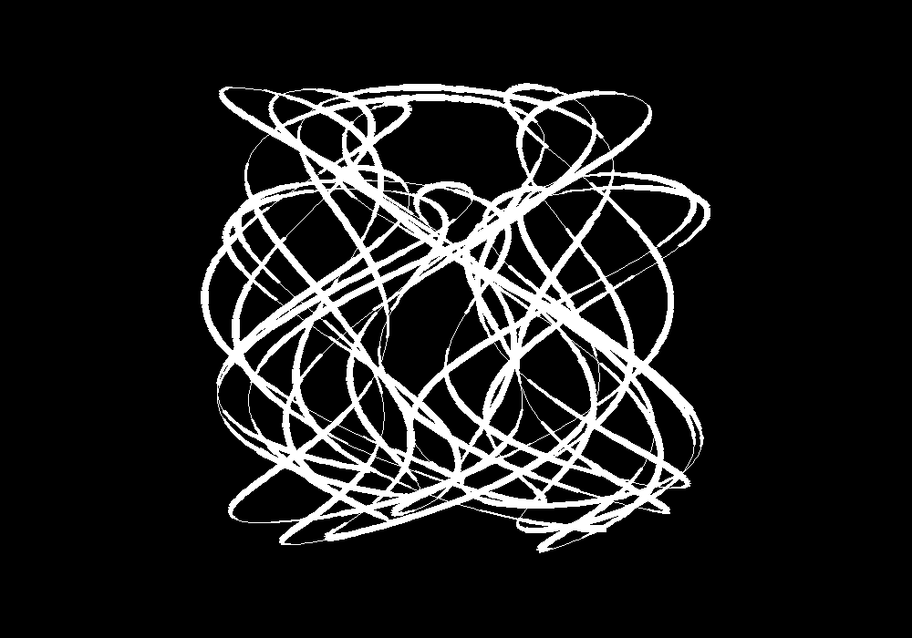

# Harmonograph

A [harmonograph](http://en.wikipedia.org/wiki/Harmonograph) is a simple machine that draws amazing patterns. 

This is an attempt to make a computer program that produces similiar patterns with 2 additional features:

* allow an extra sine wave for modulating pen width
* export the path as a GCODE file for engraving with a CNC machine

# Requirements

* Python
* Tkinter (should be installed with your Python)
* PIL library:
    * Linux - sudo pip install PIL
    * [Mac](http://stackoverflow.com/questions/9070074/how-to-install-pil-on-mac-os-x-10-7-2-lion)
    * [Windows](http://stackoverflow.com/a/4579917)
